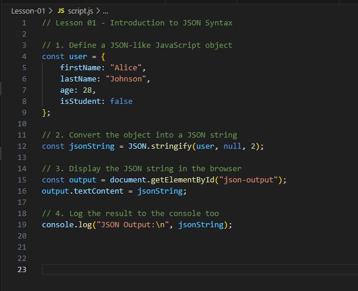

# Lesson 01 — Introduction to JSON Syntax

Welcome to Lesson 01! In this lesson, you'll learn the basics of JSON — one of the most important formats used in modern web development.

---

## 🔍 Learning Objectives
By the end of this lesson, you should be able to:
- Understand what JSON is and why it's used
- Define a simple JSON object in JavaScript
- Convert JavaScript objects into JSON strings
- Display JSON in the browser and console

---

## 📂 Lesson Files
This lesson includes the following files:

```
Lesson-01/
├── index.html
├── style.css
└── script.js
```

Open the `index.html` file with **Live Server** in VS Code to run the lesson in your browser.

---

## ✅ Step-by-Step Tasks

### Step 1: Define a JavaScript Object
In your `script.js`, define a simple object that looks like this:

```js
const user = {
  firstName: "Alice",
  lastName: "Johnson",
  age: 28,
  isStudent: false
};
```

### Step 2: Convert It to JSON
Use `JSON.stringify()` to convert the object into a JSON string:

```js
const jsonString = JSON.stringify(user, null, 2);
```

### Step 3: Display It in the Browser
Insert the JSON string into the `<pre>` element on your HTML page:

```js
const output = document.getElementById("json-output");
output.textContent = jsonString;
```

### Step 4: Console Log the Output
Just for good measure, log the same string to the console:

```js
console.log("JSON Output:\n", jsonString);
```

---

## 🤖 Screenshot of JavaScript
Before continuing, take a look at this screenshot:



Now try commenting out or deleting your code and see if you can re-create it from the screenshot!

---

## 🧪 Bonus Challenge
Create a second object with different user details:

```js
const user2 = {
  firstName: "Bob",
  lastName: "Smith",
  age: 35,
  isStudent: true
};
```

- Convert it to JSON
- Display it below the first one using the same method

---

## 📈 What You Learned
- JSON is a lightweight format used for data storage and exchange
- JavaScript objects can be converted to JSON with `JSON.stringify()`
- JSON can be easily displayed in HTML and logged to the console

---

## ✨ Well Done!
You're now ready to move on to Lesson 02, where we'll explore how to parse JSON strings into usable JavaScript data!

Happy coding! 🚀