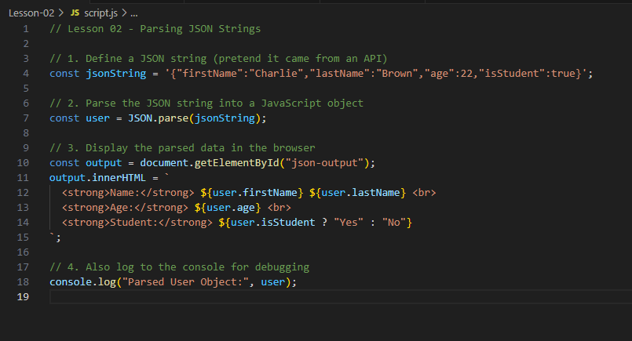

# Lesson 02 — Parsing JSON Strings

In this lesson, we’ll explore how to turn JSON strings into usable JavaScript objects using `JSON.parse()` — a key skill when working with data from APIs.

---

## 🔍 Learning Objectives
By the end of this lesson, you should be able to:
- Recognise a valid JSON string
- Use `JSON.parse()` to convert it into a JavaScript object
- Display object properties in the browser

---

## 📂 Lesson Files
```
Lesson-02/
├── index.html
├── style.css
└── script.js
```
Use Live Server to open `index.html` in your browser.

---

## ✅ Step-by-Step Tasks

### Step 1: Define a JSON String
In `script.js`, create a valid JSON string:

```js
const jsonString = '{"firstName":"Charlie","lastName":"Brown","age":22,"isStudent":true}';
```

### Step 2: Parse It
Turn the string into an object with `JSON.parse()`:

```js
const user = JSON.parse(jsonString);
```

### Step 3: Display the Data in the Browser
Insert the data into your HTML using JavaScript:

```js
const output = document.getElementById("json-output");
output.innerHTML = `
  <strong>Name:</strong> ${user.firstName} ${user.lastName} <br>
  <strong>Age:</strong> ${user.age} <br>
  <strong>Student:</strong> ${user.isStudent ? "Yes" : "No"}
`;
```

### Step 4: Console Log for Debugging
Don’t forget to use `console.log()` as well:

```js
console.log("Parsed User Object:", user);
```

---

## 🤖 Screenshot of JavaScript
Look at the screenshot below to see the full example:



Now try removing or commenting out your code and recreating it from the screenshot!

---

## 🧪 Bonus Challenge
Create another JSON string that represents a **book** object:

```json
{
  "title": "JavaScript for Beginners",
  "author": "Jane Doe",
  "year": 2023,
  "available": true
}
```

- Parse it with `JSON.parse()`
- Display all the information in your HTML

---

## 📈 What You Learned
- How to recognise and write a valid JSON string
- How to parse JSON into JavaScript objects
- How to display parsed data on a webpage

---

## ✨ Great Work!
In the next lesson, we'll explore how to handle arrays in JSON and display lists of data in your webpage.

Keep coding — you’re doing great! 🚀

