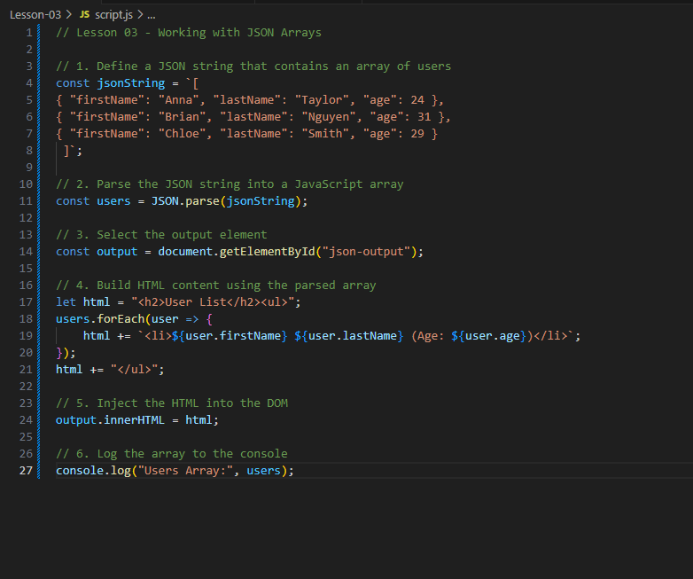

# Lesson 03 — Working with JSON Arrays

In this lesson, you'll learn how to handle JSON data that comes in the form of an **array of objects** — a very common structure in APIs and web apps.

---

## 🔍 Learning Objectives
By the end of this lesson, you should be able to:
- Recognise JSON arrays of objects
- Parse JSON arrays into JavaScript arrays
- Use `forEach()` to loop through the array and display each item in the DOM

---

## 📂 Lesson Files
```
Lesson-03/
├── index.html
├── style.css
└── script.js
```
Open `index.html` in Live Server to run the example.

---

## ✅ Step-by-Step Tasks

### Step 1: JSON String with an Array of Objects
In `script.js`, define a JSON string like this:

```js
const jsonString = '[
  {"firstName": "Anna", "lastName": "Taylor", "age": 24},
  {"firstName": "Brian", "lastName": "Nguyen", "age": 31},
  {"firstName": "Chloe", "lastName": "Smith", "age": 29}
]';
```

### Step 2: Parse It
Convert it to a JavaScript array:

```js
const users = JSON.parse(jsonString);
```

### Step 3: Use a Loop to Build HTML
Loop through the array and build an HTML list:

```js
let html = "<h2>User List</h2><ul>";
users.forEach(user => {
  html += `<li>${user.firstName} ${user.lastName} (Age: ${user.age})</li>`;
});
html += "</ul>";
```

### Step 4: Display It in the DOM
Put the generated HTML into the page:

```js
document.getElementById("json-output").innerHTML = html;
```

---

## 🤖 Screenshot of JavaScript
Paste your `missing-javascript.png` here and remove or comment out the JavaScript.



Recreate the loop from the image to get it working again!

---

## 🧪 Bonus Challenge
Add a new user object to your JSON string. Then display the total number of users below the list:

```js
const total = users.length;
document.getElementById("json-output").innerHTML += `<p><strong>Total Users:</strong> ${total}</p>`;
```

---

## 📈 What You Learned
- How to work with JSON arrays
- How to loop through an array using `forEach()`
- How to build HTML content dynamically

---

## ✨ Next Up...
In Lesson 04, you'll learn how to **load a local `.json` file** using `fetch()` and work with external data just like the pros.

Well done! 🚀

