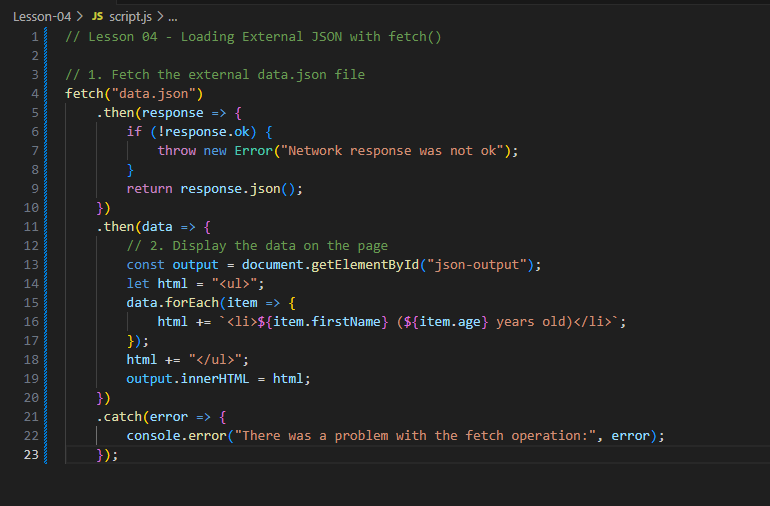

# Lesson 04 — Loading External JSON Files

In this lesson, you'll learn how to use JavaScript's `fetch()` method to load an external JSON file and display its contents dynamically.

---

## 🔍 Learning Objectives
By the end of this lesson, you should be able to:
- Load a `.json` file using `fetch()`
- Handle promises with `.then()` and `.catch()`
- Display data fetched from an external source into your HTML

---

## 📂 Lesson Files
```
Lesson-04/
├── index.html
├── style.css
├── script.js
└── data.json
```
Use Live Server to open `index.html` — **your browser must serve from localhost** for `fetch()` to work correctly.

---

## ✅ Step-by-Step Tasks

### Step 1: Create Your JSON File
Make a file named `data.json` and include this content:

```json
[
  { "firstName": "Alice", "age": 28 },
  { "firstName": "Bob", "age": 35 },
  { "firstName": "Charlie", "age": 22 }
]
```

### Step 2: Use `fetch()` to Load the File
In `script.js`:

```js
fetch("data.json")
  .then(response => {
    if (!response.ok) throw new Error("Network response was not ok");
    return response.json();
  })
  .then(data => {
    // use the JSON data here
  })
  .catch(error => console.error(error));
```

### Step 3: Display the Data
Loop through the fetched data and display it:

```js
let html = "<ul>";
data.forEach(item => {
  html += `<li>${item.firstName} (${item.age} years old)</li>`;
});
html += "</ul>";

document.getElementById("json-output").innerHTML = html;
```

---

## 🤖 Screenshot of JavaScript
Here's your reference image:



Now try removing some of your code and recreating it from the screenshot!

---

## 🧪 Bonus Challenge
Update the `data.json` file to include a new field, like `isStudent`, and display a badge for students only:

```json
{ "firstName": "Dana", "age": 40, "isStudent": true }
```

Update your HTML output to conditionally show **(Student)** next to their name.

---

## 📈 What You Learned
- How to fetch external JSON data using JavaScript
- How to handle promises with `.then()` and `.catch()`
- How to generate HTML from loaded data

---

## ✨ Excellent Progress!
Next time, we'll use a public API to fetch live data and display it in your app!

Keep going — you're doing amazing! 🚀

