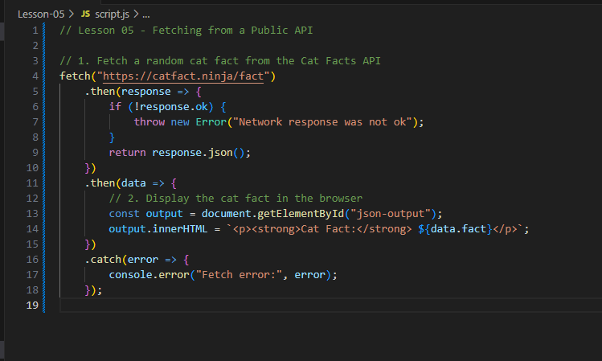

# Lesson 05 — Fetching from a Public API

In this lesson, you'll learn how to fetch real-time data from a public API and display it on your webpage.

We'll use the **Cat Facts API** because it's free, easy to use, and doesn't require an API key!

---

## 🔍 Learning Objectives
By the end of this lesson, you should be able to:
- Use `fetch()` to get data from a live public API
- Parse the JSON response
- Display the fetched data in the browser

---

## 📂 Lesson Files
```
Lesson-05/
├── index.html
├── style.css
└── script.js
```
Open `index.html` using Live Server in VS Code.

---

## ✅ Step-by-Step Tasks

### Step 1: Choose an API
We're using the Cat Facts API:

```
https://catfact.ninja/fact
```

It returns a JSON object like this:

```json
{
  "fact": "Cats sleep for 70% of their lives.",
  "length": 38
}
```

### Step 2: Use `fetch()` to Call the API
In `script.js`:

```js
fetch("https://catfact.ninja/fact")
  .then(response => response.json())
  .then(data => {
    // use the data
  })
  .catch(error => console.error(error));
```

### Step 3: Display the Fact
Update the DOM to show the cat fact:

```js
const output = document.getElementById("json-output");
output.innerHTML = `<p><strong>Cat Fact:</strong> ${data.fact}</p>`;
```

---

## 🤖 Screenshot of JavaScript
Here's your visual cue:



Delete or comment out your code and try rebuilding it by studying the screenshot.

---

## 🧪 Bonus Challenge
- Add a button that fetches a **new** cat fact every time it's clicked.
- Add a loader message (e.g. "Loading...") while waiting for the API to respond.

---

## 📈 What You Learned
- How to use `fetch()` to call a public API
- How to parse and use a JSON response
- How to dynamically update HTML based on live data

---

## ✨ You're Almost There!
In our final lesson, you’ll build a small app that lets users input and update data locally using a JSON-based structure.

Keep up the awesome work! 🚀

