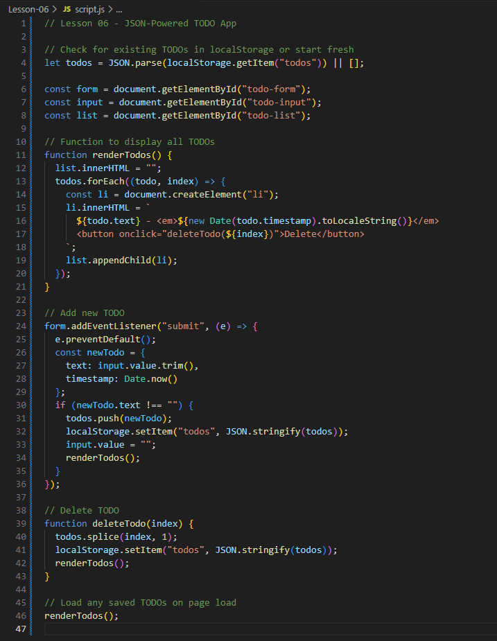

# Lesson 06 — Building a Mini JSON-Powered TODO App

In this final lesson, you’ll use everything you’ve learned to build a simple TODO list app powered by JSON and `localStorage`.

You’ll create, save, display, and delete items — all stored in your browser using JavaScript and JSON!

---

## 🔍 Learning Objectives
By the end of this lesson, you should be able to:
- Create structured data using JavaScript objects
- Store and retrieve data using `localStorage`
- Convert data to and from JSON using `JSON.stringify()` and `JSON.parse()`
- Dynamically render and update HTML from your data

---

## 📂 Lesson Files
```
Lesson-06/
├── index.html
├── style.css
└── script.js
```
Run `index.html` with Live Server and test your app in the browser.

---

## ✅ Step-by-Step Tasks

### Step 1: Setup Your Form
In `index.html`, create a form with an input and a list:

```html
<form id="todo-form">
  <input type="text" id="todo-input" placeholder="Enter a task..." required />
  <button type="submit">Add</button>
</form>
<ul id="todo-list"></ul>
```

### Step 2: Store TODOs in localStorage
In `script.js`, use this logic:

```js
let todos = JSON.parse(localStorage.getItem("todos")) || [];
```

Use `JSON.stringify()` when saving:

```js
localStorage.setItem("todos", JSON.stringify(todos));
```

### Step 3: Render the TODOs
Loop through the array and build list items:

```js
function renderTodos() {
  // clear then rebuild the list
  todos.forEach(todo => {
    // create list elements and display them
  });
}
```

### Step 4: Add and Delete Items
Allow users to add new items and delete existing ones. Use the array index to track what to remove.

---

## 🤖 Screenshot of JavaScript
Here’s your visual reference:



Try deleting the JavaScript and rebuilding it based on what you see!

---

## 🧪 Bonus Challenge
- Add a checkbox next to each item to mark it as complete
- Save the `completed: true/false` status in localStorage
- Style completed items differently (e.g. strike-through)

---

## 📈 What You Learned
- How to use JSON with `localStorage`
- How to render data-driven interfaces
- How to structure objects with timestamps and values

---

## ✨ Well Done!
You’ve now completed a 6-lesson journey learning to use JSON like a true web developer. 🎉

Keep experimenting, building, and coding!

Happy hacking! 🚀

